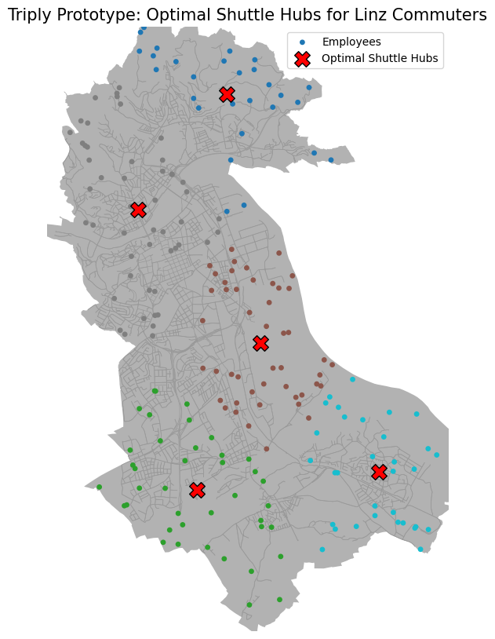

# Linz Employee Shuttle Optimization: A Geospatial ML Prototype

  

## 📍 Project Overview
This project is a **Geospatial Machine Learning prototype** designed to solve a "First-Mile/Last-Mile" mobility problem in Linz, Austria. 

Motivated by the mission of **Triply**, this tool simulates a workforce distribution within the city and utilizes clustering algorithms to identify optimal "Hub Locations" for corporate shuttle services. The goal is to minimize the carbon footprint of commuting by replacing single-occupancy vehicles with optimized group transport.

## 📊 The Output
*(Place the screenshot of the map you generated here. Name the file `linz_map_result.png`)*


## 🛠 Tech Stack
* **Data Acquisition:** `OSMnx` (OpenStreetMap API) for street networks and city boundaries.
* **Geospatial Processing:** `GeoPandas` & `Shapely` for polygon manipulation and coordinate projection.
* **Machine Learning:** `Scikit-Learn` (K-Means Clustering) for spatial optimization.
* **Visualization:** `Matplotlib` for plotting the street graph and cluster centroids.

## 🧠 Methodology

### 1. Geospatial Data Ingestion
The script fetches the administrative boundary of **Linz, Austria** and its driving network graph using `OSMnx`.

### 2. Synthetic Population Generation
To simulate a privacy-safe dataset:
* The script generates **200 synthetic employee home locations**.
* It utilizes a geometric check (`point.within(polygon)`) to ensure all data points fall strictly within the Linz city limits.

### 3. Hub Optimization (ML)
Using **K-Means Clustering**, the algorithm:
* Groups employees based on spatial proximity.
* Calculates the centroids of these groups to propose **5 Optimal Shuttle Pickup Hubs**.

### 4. Efficiency Analysis
The script calculates the **Average Displacement** (Haversine distance) from employee homes to their assigned hub to measure the "walkability" of the proposed solution.

## 📉 Results & Analysis

* **Number of Hubs:** 5
* **Simulated Workforce:** 200 Employees
* **Average Walking Distance:** `2,140 meters` (~2.1 km)

### 💡 Critical Insight
While the model successfully identified central hubs, an average walking distance of **2.1 km** indicates that **5 hubs are insufficient** for a city the size of Linz to achieve high adoption rates. 

**Next Steps for Optimization:**
1.  **Increase Hub Count:** Run an "Elbow Method" analysis to find the optimal number of hubs to bring walking distance under 500m.
2.  **Network Distance:** Replace Haversine (straight-line) distance with `network_distance` (Manhattan distance) to account for actual street layouts.
3.  **Density-Based Clustering:** Switch from K-Means to **DBSCAN** or **HDBSCAN** to better handle noise and irregular cluster shapes in suburban areas.

## 🚀 How to Run

1.  **Clone the repository**
    ```bash
    git clone [https://github.com/YOUR_USERNAME/linz-mobility-optimizer.git](https://github.com/YOUR_USERNAME/linz-mobility-optimizer.git)
    cd linz-mobility-optimizer
    ```

2.  **Install Dependencies**
    ```bash
    pip install osmnx geopandas scikit-learn matplotlib
    ```

3.  **Run the Script**
    ```bash
    python optimize_routes.py
    ```

## 👨‍💻 Author
**[Your Name]**
* **Role:** AI/ML Engineer (Aspiring Intern)
* **Focus:** Sustainable Mobility & Spatial Data Science
* [LinkedIn Profile Link]
